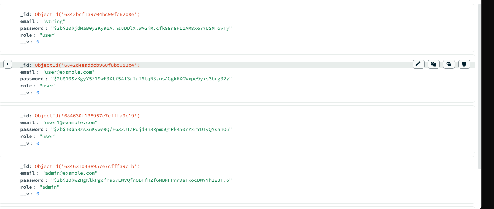
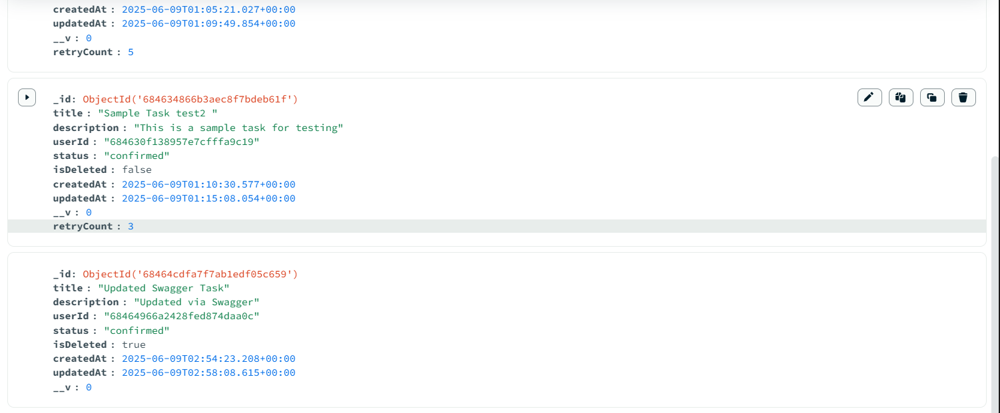
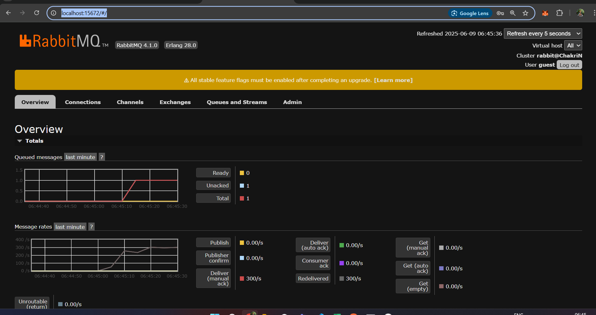
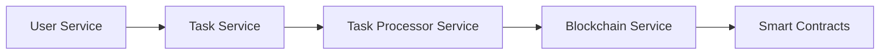
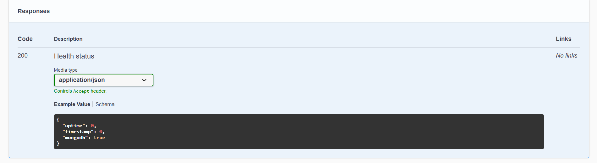

# Task Management System with Blockchain Integration

A comprehensive microservices-based task management system that leverages blockchain technology for secure and immutable task storage. The system is built using TypeScript, Node.js, and Ethereum smart contracts.

## System Architecture

The system consists of five main microservices:

1. **User Service**: Handles user authentication and management
2. **Task Service**: Manages task operations and API endpoints
3. **Task Processor Service**: Processes tasks and synchronizes with blockchain
4. **Blockchain Service**: Interfaces with Ethereum blockchain
5. **Smart Contracts**: Ethereum smart contracts for task storage

## Database and Message Queue

### MongoDB Collections



### RabbitMQ Configuration


## System Flow



## Services Overview

### 1. User Service


The User Service handles:
- User registration and authentication
- JWT-based secure access
- Role-based access control
- User profile management

#### API Endpoints

##### Health Check


##### Register User


##### Login


##### Get User Profile


### 2. Task Service


The Task Service provides:
- RESTful API for task management
- Task CRUD operations
- Message queue integration
- Rate limiting and security

#### API Endpoints

##### Health Check


##### Create Task


##### Get All Tasks


##### Get Task by ID


##### Update Task


##### Delete Task


### 3. Task Processor Service

The Task Processor Service:
- Processes task operations asynchronously
- Manages blockchain synchronization
- Handles retry mechanisms
- Provides reliable message queue processing

### 4. Blockchain Service


The Blockchain Service:
- Interfaces with Ethereum blockchain
- Manages smart contract interactions
- Handles transaction processing
- Provides blockchain status updates

#### API Endpoints

##### Health Check


##### Get Task


##### Create/Update Task


##### Update Task Status


##### Delete Task


### 5. Smart Contracts


The Smart Contracts provide:
- Decentralized task storage
- Immutable task records
- Batch operations support
- Event emission for tracking

## Prerequisites

- Node.js (v14 or higher)
- MongoDB
- RabbitMQ
- Ethereum node (local or remote)
- TypeScript
- Hardhat (for smart contract development)

## Installation

1. Clone the repository:
```bash
git clone <repository-url>
cd task-management-backend
```

2. Install dependencies for each service:
```bash
cd user-service && npm install
cd ../task-service && npm install
cd ../task-processor-service && npm install
cd ../blockchain-service && npm install
cd ../contracts && npm install
```

3. Create `.env` files in each service directory:

User Service:
```env
PORT=3000
MONGODB_URI=mongodb://localhost:27017/user-service
JWT_SECRET=your_jwt_secret
```

Task Service:
```env
PORT=3001
MONGODB_URI=mongodb://localhost:27017/task-service
JWT_SECRET=your_jwt_secret
RABBITMQ_URL=amqp://localhost
```

Task Processor Service:
```env
MONGODB_URI=mongodb://localhost:27017/task-service
ETHEREUM_NODE_URL=http://localhost:8545
ADMIN_PRIVATE_KEY=your_private_key
CONTRACT_ADDRESS=your_contract_address
RABBITMQ_URL=amqp://localhost
```

Blockchain Service:
```env
PORT=3002
ETHEREUM_NODE_URL=http://localhost:8545
ADMIN_PRIVATE_KEY=your_private_key
CONTRACT_ADDRESS=your_contract_address
```

Contracts:
```env
PRIVATE_KEY=your_wallet_private_key
INFURA_API_KEY=your_infura_api_key
ETHERSCAN_API_KEY=your_etherscan_api_key
```

## Running the System

1. Start MongoDB and RabbitMQ:
```bash
# Start MongoDB
mongod

# Start RabbitMQ
rabbitmq-server
```

2. Deploy Smart Contracts:
```bash
cd contracts
npx hardhat compile
npx hardhat run scripts/deploy.ts --network localhost
```

3. Start the Services:
```bash
# Start User Service
cd user-service
npm run dev

# Start Task Service
cd task-service
npm run dev

# Start Task Processor Service
cd task-processor-service
npm run dev

# Start Blockchain Service
cd blockchain-service
npm run dev
```

## API Documentation

Each service provides Swagger UI documentation:
- User Service: `http://localhost:3000/api-docs`
- Task Service: `http://localhost:3001/api-docs`
- Blockchain Service: `http://localhost:3002/api-docs`

## Security Features

- JWT-based authentication
- Role-based access control
- Password hashing with bcrypt
- Rate limiting
- Input validation
- Secure headers
- Blockchain immutability

## Error Handling

Each service implements comprehensive error handling:
- Input validation
- Authentication errors
- Database errors
- Blockchain transaction errors
- Message queue errors
- Rate limiting
- Retry mechanisms

## Logging

All services use Winston for logging:
- User Service: `user-service.log`
- Task Service: `task-service.log`
- Task Processor Service: `task-processor-service.log`
- Blockchain Service: `blockchain-service.log`

## Project Structure

```
task-management-backend/
├── user-service/           # User management and authentication
├── task-service/          # Task management API
├── task-processor-service/ # Task processing and blockchain sync
├── blockchain-service/    # Blockchain interaction
└── contracts/            # Smart contracts
```

## Dependencies

### Common Dependencies
- TypeScript
- Express
- MongoDB
- Winston
- Swagger UI

### Service-Specific Dependencies
- User Service: JWT, bcrypt
- Task Service: RabbitMQ, rate-limiter
- Task Processor Service: ethers.js, amqplib
- Blockchain Service: ethers.js
- Contracts: Hardhat, ethers.js

## Contributing

1. Fork the repository
2. Create your feature branch (`git checkout -b feature/amazing-feature`)
3. Commit your changes (`git commit -m 'Add some amazing feature'`)
4. Push to the branch (`git push origin feature/amazing-feature`)
5. Open a Pull Request

## License

This project is licensed under the ISC License.

