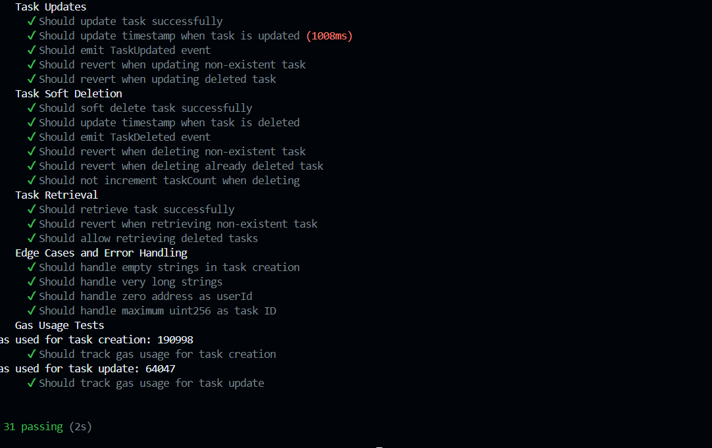

# Smart Contracts for Task Management

This repository contains the smart contracts for a decentralized task management system built on Ethereum. The contracts are written in Solidity and use Hardhat for development, testing, and deployment.

## Overview

The main contract `TaskStorage.sol` implements a decentralized storage system for tasks with the following features:

- Task creation, updating, and soft deletion
- Batch operations for gas optimization
- Access control with admin privileges
- Event emission for better tracking and indexing
- Comprehensive input validation

## Smart Contract Features

### Task Structure
```solidity
struct Task {
    string id;
    string title;
    string description;
    string userId;
    string status;
    uint256 timestamp;
    bool isDeleted;
}
```

### Key Functions
- `createTask`: Create a new task
- `updateTask`: Update an existing task
- `softDeleteTask`: Soft delete a task
- `getTask`: Retrieve task details
- `batchCreateTasks`: Create multiple tasks in one transaction
- `batchUpdateTasks`: Update multiple tasks in one transaction

### Security Features
- Admin-only access control
- Input validation
- Soft deletion mechanism
- Event emission for tracking

## Prerequisites

- Node.js (v14 or higher)
- npm or yarn
- Hardhat
- MetaMask or similar Web3 wallet

## Installation

1. Clone the repository
2. Install dependencies:
```bash
npm install
```

3. Create a `.env` file in the root directory with the following variables:
```env
PRIVATE_KEY=your_wallet_private_key
INFURA_API_KEY=your_infura_api_key
ETHERSCAN_API_KEY=your_etherscan_api_key
```

## Development

### Compile Contracts
```bash
npx hardhat compile
```

### Run Tests
```bash
npx hardhat test
```



### Deploy Contracts
```bash
npx hardhat run scripts/deploy.ts --network <network-name>
```

## Contract Architecture

```
contracts/
├── TaskStorage.sol     # Main contract for task management
├── test/              # Test files
├── scripts/           # Deployment scripts
└── artifacts/         # Compiled contracts
```

## Testing

The contract includes comprehensive tests covering:
- Task creation and retrieval
- Task updates
- Soft deletion
- Batch operations
- Access control
- Input validation

## Gas Optimization

The contract implements several gas optimization techniques:
- Batch operations for multiple tasks
- Efficient storage layout
- Minimal state changes
- Optimized event emission

## Events

The contract emits the following events for better tracking:
- `TaskCreated`: When a new task is created
- `TaskUpdated`: When a task is updated
- `TaskDeleted`: When a task is soft deleted
- `TaskBatchCreated`: When multiple tasks are created
- `TaskBatchUpdated`: When multiple tasks are updated

## Security Considerations

- Only admin can perform write operations
- Input validation for all parameters
- Soft deletion instead of hard deletion
- Event emission for tracking all changes
- No direct ETH transfers

## Contributing

1. Fork the repository
2. Create your feature branch (`git checkout -b feature/amazing-feature`)
3. Commit your changes (`git commit -m 'Add some amazing feature'`)
4. Push to the branch (`git push origin feature/amazing-feature`)
5. Open a Pull Request

## License

This project is licensed under the MIT License - see the [LICENSE](LICENSE) file for details.
